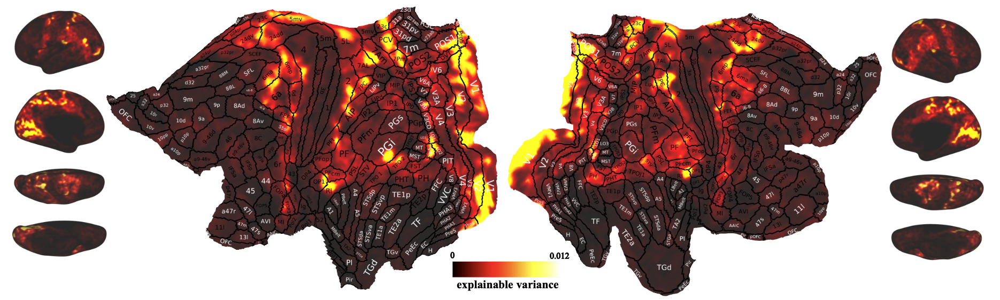
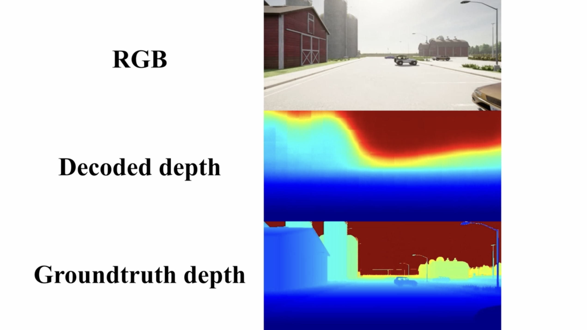

# Geometry representations in human spatial navigation
> We are still updating the code and documentation.

To quickly explore geometry reprentations without processing large datasets, please use the [spatial_startup](startup/spatial_startup.ipynb) first.

This repo provides the code and data for our work:
```
Taiping Zeng, Mingbo Cai, Geometry representations along visual pathways in human spatial navigation, 2024
```

Specifically, it provides the code to perform experiment and analysis the fMRI data, including:
1. fMRI experiment;
2. data preprocess;
3. data analysis;
4. results visualization.

## 1. fMRI experiment

First, we generate the experimental stimuli from [CARLA](https://github.com/carla-simulator/carla), which is an open-source simulator for autonomous driving research.
Then, we use [PsychoPy](https://github.com/psychopy/psychopy) to design and run the fMRI experiment.

### a. carla
Carla (CARLA 0.9.13) is used to generate the experimental stimuli data and the training data for the varational autoencoder of latent representions, the script code can be found [here](fMRI_experiment_setup/carla/carla_run_recording.py).

### b. psychopy
All subjects watch videos from Psychopy (2021.2.3) with the same geometric structures, but with random weather and lighting conditions. The source can be found in [spatial_psychopy](https://github.com/geometry-in-human-navigation/spatial_psychopy.git).

- After images are recorded from CARLA, [a shell script](<1-experiment/b. psychopy/data_prepare/image_data_check.sh>) is used to check image data.

- If it is qualified, the ffmpeg command is applied to [generate videos](<1-experiment/b. psychopy/data_prepare/video_generation.sh>).

- To make sure that videos are generated correctly, use [the check script](<1-experiment/b. psychopy/data_prepare/video_check.sh>) to verify it.

## 2. data preprocess
### a. files are organized with BIDS format
- We organize the dicom data to the nifti data with [BIDS format](https://bids.neuroimaging.io/).

### b. freesurfer
- We convert T1w to surfer using [freesurfer](https://surfer.nmr.mgh.harvard.edu/) (7.2.0).

### c. afni proc
- We use [afni](https://afni.nimh.nih.gov/) to correct the fMRI data, registrate between functional (epi) and structural data, create neural mask of ROIs.

## 3. data analysis
The data analysis follows the steps: a. shared response modeling, b. deep generative modeling, c. general linear modeling.

### a. shared response modeling
- create masks of parcellated brain regions according to MNI_Glasser_HCP_v1
- set the max feature dimensions by optimal hard threshold 
- iterate possible number of feature dimensions to choose max number of effective brain regions
- shared response modeling with feature dimensions

### b. deep generative modeling
- generate dataset with random angles from CARLA
- train a variational autoencoder to infer depth structure

### c. general linear modeling
- depth
  - get design matrix using brainiak from latent representations
  - general linear model for depth features
  - reconstruct geometric structures by matching decoded embeddings in a time window
- roadtypes
  - maually label road types for each TRs
  - get design matrix using brainiak from road type labels
  - general linear model for roadtype features

## 4. results visualization
We use [connectome-workbench 1.5.0](https://www.humanconnectome.org/software/connectome-workbench) to visualize the results on the flatten brain. 
- a. first use python scripts to genearte .dlable.nii and .shape.gii files.
- b. [scene examples](https://balsa.wustl.edu/study/show/RVVG) in the connectome workbench from (Glasser et al. 2016) is modified to visulize the results.
- c. comparison of rgb stimuli, decoding depth, and groundtruth depth. the final comparison video can be found here [comparison_rgb_decoded_gt.mp4](startup/output_videos/comparison_rgb_decoded_gt.mp4).
[](startup/output_videos/comparison_rgb_decoded_gt.mp4)


